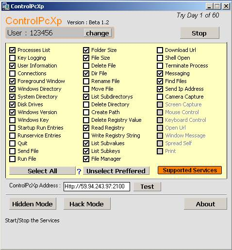



## Commercial ControlPcXp Now Open Source

### Description

This is Commercial ControlPcXp . The Server Side Program to use a pc from anywhere in the world . The Client Side is only Internet Explorer. It is the Lightest Program to use your pc from other computers . It Supports Many Services (SEE PIC) .

Need Help For Further Development . Contact ajaybnl@gmail.com
 
### More Info
 

             |
---                |---
**Submitted On**   |2008-02-05 12:42:54
**By**             |[ajaybnl](https://github.com/Planet-Source-Code/PSCIndex/blob/master/ByAuthor/ajaybnl.md)
**Level**          |Advanced
**User Rating**    |5.0 (10 globes from 2 users)
**Compatibility**  |VB 6\.0
**Category**       |[Internet/ HTML](https://github.com/Planet-Source-Code/PSCIndex/blob/master/ByCategory/internet-html__1-34.md)
**World**          |[Visual Basic](https://github.com/Planet-Source-Code/PSCIndex/blob/master/ByWorld/visual-basic.md)
**Archive File**   |[Commercial2109524142008\.zip](https://github.com/Planet-Source-Code/ajaybnl-commercial-controlpcxp-now-open-source__1-70413/archive/master.zip)

